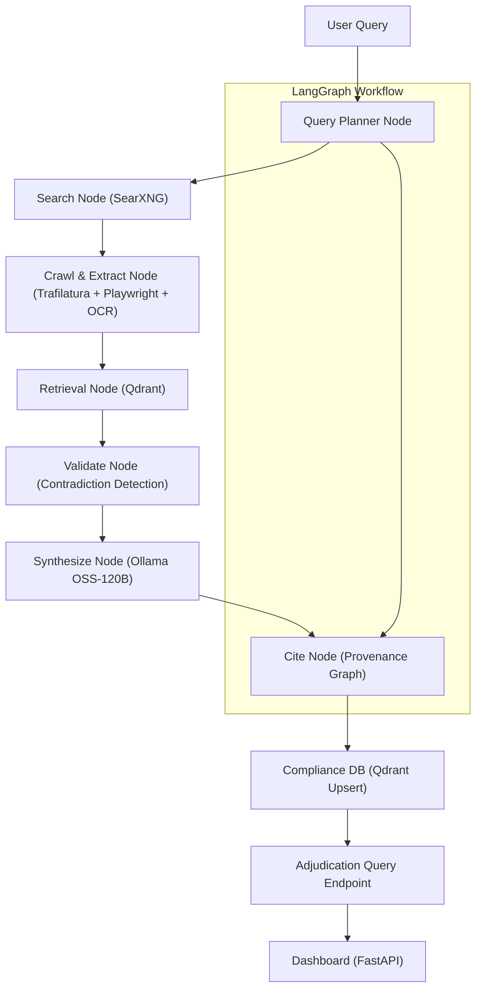

## High-Level Architecture Specification

### Purpose
Define the updated architecture to extend the current multi-agent pipeline with graph-based orchestration (LangGraph), enhanced search/crawl, a managed vector database, local LLMs, and evaluation. The goal is multi-hop research with provenance, contradiction detection, and a robust compliance knowledge base.

### Scope
- Create and maintain this document (`docs/architecture.md`).
- Update `README.md` to reference this document.
- Introduce LangGraph workflow nodes that gradually replace direct agent calls while preserving backward compatibility.

### Overall Flow Diagram

### Components Overview
- **Orchestration (LangGraph)**: Stateful multi-hop graph with up to 3 hops and conditional loops if coverage falls below threshold.
- **Search (SearXNG)**: Self-hosted metasearch integrated into sourcing with `site:gov` emphasis; Brave fallback (optional).
- **Crawl & Extract**: Trafilatura as primary; Playwright fallback for JS-heavy; Unstructured OCR for PDFs/images.
- **Retrieval (Qdrant)**: Hybrid search with metadata filters (jurisdiction, source, citation). Replaces FAISS for production; FAISS remains as dev fallback.
- **LLM (Ollama)**: Local models for privacy and cost control; large model for synthesis and smaller for extraction/planning.
- **Validation/Synthesis**: Contradiction detection across facts, conservative synthesis, and a claim→evidence provenance graph.
- **Database**: Qdrant as the vector store of record; SQLite remains for run logs and metrics.
- **Evaluation (RAGAS)**: Quantifies faithfulness, answer relevancy, and custom metrics (citation coverage, extraction accuracy).
- **Dashboard/CLI**: FastAPI dashboard gains evaluation views; CLI gains `--deep-research` to run the LangGraph workflow.

### Data Flow
1) Query decomposed into sub-queries (plan).
2) Search and crawl fetch authoritative sources with robust extraction/OCR.
3) Documents embedded and upserted into Qdrant with metadata (source URL, jurisdiction, citation).
4) Facts extracted and cross-validated for contradictions.
5) Synthesis produces FCRA-relevant outputs with citations and provenance graph.
6) Knowledge base supports adjudication queries and dashboard exploration.

### Scalability & Security
- Cap hops at 3; cache embeddings; reuse crawled content by URL/content hash.
- Respect robots.txt and add polite crawl delays; rotate user agents.
- Redact secrets in logs and disable external calls in CI.

### Dependencies
- Python: `langgraph`, `langchain`, `qdrant-client`, `langchain-qdrant`, `ollama`, `trafilatura`, `playwright`, `unstructured[pdf]`, `ragas`, `datasets`.
- Docker: SearXNG, Qdrant.

### Testing Criteria
- End-to-end sample query runs through LangGraph with ≤3 hops.
- Mermaid diagram renders in Markdown preview.

### Integration Points
- Linked from `README.md` Architecture section.
- Referenced by sourcing/extraction code and the research CLI when `--deep-research` is used.

